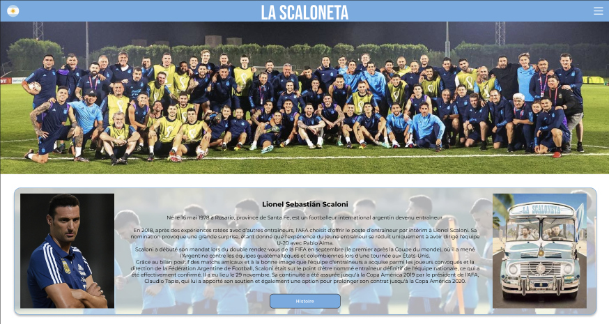

 # ✨ Fansite
 HTML and CSS group project for school 
 Original repository : https://github.com/AdelinePat/fansite.git

 ## 📝 Instructions
 1. Create an index page for redirecting to all 3 group member fansite
 2. Create a fansite per member
 3. Each fansite must have multiple pages, including galeries (photos, videos), social media links...

## 👥 Group members
- [@AdelinePat](https://github.com/AdelinePat) : Blackpink fansite
- [@maeva-sallot](https://github.com/maeva-sallot) : Euromillion fansite
- [@noa-cen](https://github.com/noa-cen) : Scaloneta fansite
  
We decided to name our website Limonade because this word has all the letters of our names (except for the V). 

### <u>Color used :</u>
| Color             | Hex                                                                |
| ----------------- | ------------------------------------------------------------------ |
| Light grey |  #D8D8D8 |
| Dark grey |  #111111 |
| Grey |  #303030 |
| Blackpink pink |  #EFA7B5 |
| Euromillion yellow |  #EEBB05 |
| Argentina blue|  #6CACE4 |

### <u>Preview :</u>

### <u>Model Figma :</u>

